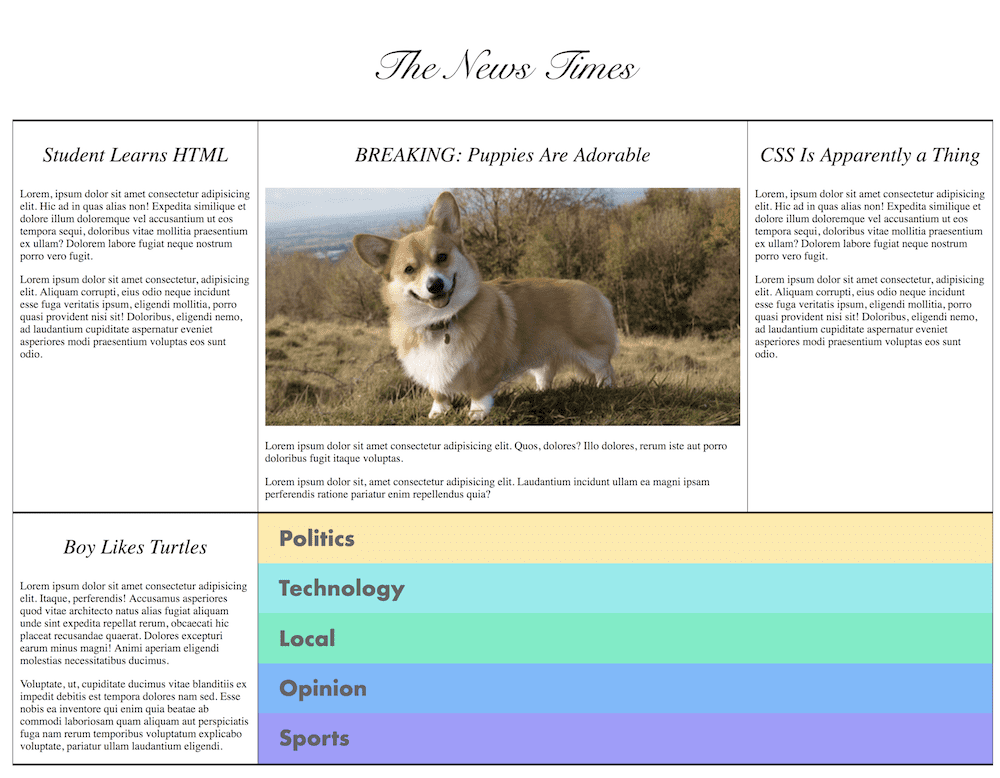

# CSS Flex and Corgis : )

Project design:

The Focus of the project is on using CSS Flex to implement the layout.

The Project is from [Frontend Masters](https://frontendmasters.com/) and the project details can be found in the [opensourced notes](https://btholt.github.io/intro-to-web-dev-v2/project-html-css/).
